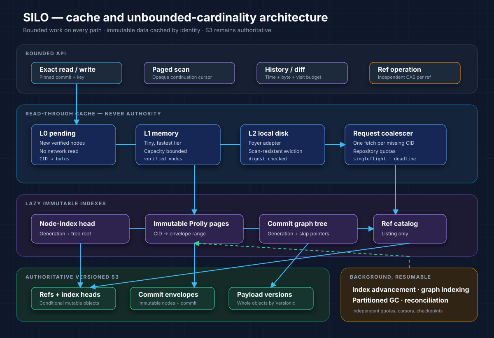
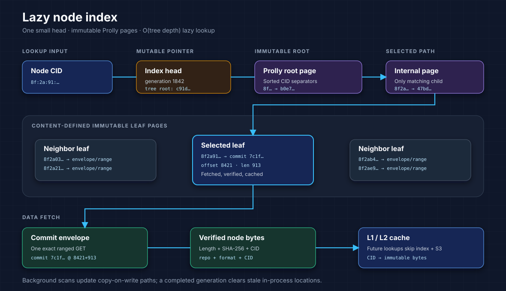

# Prolly S3 cache and unbounded-cardinality design

Status: implemented as rebuildable v2 scale metadata alongside the frozen
Prolly S3 Protocol v1. Local correctness tests and a RustFS qualification
harness are included; the million/billion-object AWS qualification tiers remain
release gates, not completed claims.

## Decision

Prolly S3 will support **unbounded repository cardinality**: the protocol will
not impose a fixed maximum number of files, commits, or refs. Every scale-safe
API must nevertheless have bounded memory, bounded concurrency, and a resumable
work budget. Legacy whole-result compatibility APIs retain explicit limits.

“Unlimited” cannot mean infinite storage, zero-cost global queries, or infinite
history traversed in one request. Capacity remains constrained by object-store
quotas, account throughput, retention cost, identifier space, and elapsed time.
The useful promise is that growing the repository does not require loading or
rewriting all repository metadata and does not eventually hit a format-level
cardinality ceiling.



## Goals

- Support billions of live file keys and substantially more retained versions.
- Support continuously growing commit history and ref namespaces.
- Keep repository open independent of repository cardinality.
- Make exact key lookup logarithmic in the Prolly tree size and independent of
  total commit count.
- Bound RAM, local disk, S3 calls, concurrency, and CPU for every request.
- Keep the existing three-call foreground write path.
- Let caches fail open without changing repository correctness.
- Make scans, history walks, indexing, and garbage collection resumable.

## Non-goals

- A single response containing every key, commit, or ref.
- Constant-time arbitrary history or global aggregation queries.
- Unbounded throughput on one hot branch. Publication for a branch is still a
  serialized, fenced compare-and-exchange.
- Treating a local cache or derived index as authoritative state.
- Claiming billion-object readiness before the qualification gates pass.

## Scale model

The logical object and version maps remain Prolly trees. Their immutable nodes
are addressed by content ID (CID), so one verified node can be reused across
snapshots and safely cached. With a representative fanout near 128, one billion
entries needs about five index levels; the exact height depends on encoded key
sizes and chunk boundaries.

Repository-wide work is divided into four independent dimensions:

| Dimension | Authoritative representation | Scale strategy |
|---|---|---|
| Files and logical versions | Immutable Prolly trees | Logarithmic lookup; streamed range scans |
| Commits | Immutable commit envelopes | Direct ID lookup; segmented skip index for graph walks |
| Refs | One conditional object per ref | Direct lookup; derived sharded catalog for listing |
| Node locations | Immutable index pages | Lazy prefix-sharded lookup; generation-aware cache |

No healthy foreground lookup uses `ListObjects`, loads a complete checkpoint,
or scans commit envelopes.

## Read path and cache hierarchy

The core crate defines an asynchronous `NodeCache` interface. A client adapter
may implement it with [Foyer](https://github.com/foyer-rs/foyer) as a hybrid
memory-and-disk cache. The repository engine remains usable without Foyer.

```text
pending write set
    -> L1 memory cache
    -> L2 local-disk cache
    -> node-location cache
    -> sharded node index
    -> ranged GET from immutable commit envelope
    -> verify CID and SHA-256
    -> admit to L1/L2
```

Concurrent misses for the same cache key are singleflighted. A cold lookup
therefore fetches each distinct node at most once per process at a time; a warm
lookup performs no metadata-node S3 reads. Fetching the file body remains one
version-qualified S3 `GetObject`.

After a branch CAS succeeds—or an ambiguous CAS is reconciled by operation
ID—the writer admits every node in the committed pack to the configured cache.
Foyer flushes those verified immutable nodes to disk on graceful close. A
reader reopening the same cache directory can therefore traverse the writer's
snapshot without re-fetching nodes. A new host can call
`Client::prewarm_node_cache` for selected snapshots and prefixes before serving
traffic.

### Cache keys

Node bytes use this logical cache key:

```text
(repository_namespace, protocol_version, tree_format_digest, cid)
```

The repository namespace prevents cross-tenant disclosure. Protocol and tree
format prevent an old decoder from consuming incompatible bytes. A deployment
may deliberately share verified nodes across repositories only when its trust
and encryption policy permits it.

The bounded in-process node-location map uses:

```text
(repository_namespace, cid) -> (envelope, byte_range, digest)
```

When a complete node-index scan publishes a new root, the in-process location
map is cleared. Immutable node bytes remain cached by CID; locations are then
resolved lazily through the newly pinned index root. GC also marks the actual
container selected for every reachable CID before deleting envelopes.

### Admission and eviction

- Insert only after length, SHA-256, and CID verification.
- Admit roots and internal nodes with higher priority than scan-only leaves.
- Admit the requested node, not every node in its containing commit envelope.
- Use capacity eviction, not TTL, for immutable node bytes.
- Use a scan-resistant policy such as S3-FIFO for the disk tier.
- Use short, generation-scoped negative caching only for confirmed misses.
- Treat cache corruption or I/O failure as a miss; evict and refetch.
- Never use cached ref state to authorize a mutation.

Recommended initial per-process budgets are 256–512 MiB for memory and
10–50 GiB for local disk, exposed as configuration rather than protocol
constants. Operators size them from the working-set and hit-rate metrics.

### Cached values

| Value | Cache policy | Authority check |
|---|---|---|
| Prolly node bytes | Memory + disk, immutable | Verify digest on admission and disk hit |
| Commit envelopes | Bounded memory/disk, immutable | Verify `CommitId` and envelope digest |
| Node-index pages | Memory + disk by generation | Verify page digest from parent |
| Node locations | Bounded memory by generation | Resolve from verified index page |
| Branch/tag refs | Tiny in-process cache only | Fresh conditional ref read for publication |
| File payload | Application/CDN decision | Version-qualified key plus committed checksum |

The existing whole-pack cache becomes an optional secondary optimization. It
must not be the primary cache because one hot node should not retain or fetch a
large envelope.

## Sharded node index v2

Protocol v1 points to one checkpoint containing every known node location.
Opening that checkpoint is O(total nodes) in bytes and memory, so it cannot be
the billion-node design.

Version 2 replaces it with a small mutable head and a separate immutable,
content-addressed Prolly tree:



1. `node-index/v2/head.cbor` identifies the tree root and scan generation.
2. Tree keys are CIDs; values contain the commit envelope, byte range, length,
   pack identity, and digest.
3. Native Prolly chunk boundaries split the index incrementally; no monolithic
   checkpoint is decoded at repository open.
4. A lookup reads only one root-to-leaf path, then caches verified index pages
   and the requested data node.

Checkpoint construction is background work. It merges new commit-envelope
indexes into affected copy-on-write pages and conditionally advances the head.
The commit envelope remains a self-describing correctness fallback, so a lost
checkpoint update delays lookup optimization but cannot lose committed data.
No index-maintenance S3 call is added to the three-call foreground write.

Each lookup clones one validated head root before traversing it. Immutable nodes
therefore remain readable while a concurrent maintainer publishes a newer
root. Reclaiming unreachable generations is separate, grace-period-protected
maintenance and is not on the foreground lookup path.

## Files and versions

Exact lookup follows one root-to-leaf Prolly path. Range listing returns a
bounded page and an opaque continuation cursor containing the pinned commit,
tree root, last key, and traversal state. It never assembles all keys in RAM.

Large file bodies continue to be whole S3 objects or provider-native multipart
uploads. Repository scale does not reintroduce content chunking.

A single file with extreme version count remains distributed through the
composite-key version tree. If profiling shows a pathological hot-key history,
immutable per-key history segments may be added as a derived accelerator; they
must not become a second authority.

## Commits and graph traversal

Commits stay immutable and directly addressable by `CommitId`. Repository open
does not enumerate commits.

`log_page_bounded` uses a `TraversalBudget` with:

- maximum visited commits;
- maximum decoded bytes;
- maximum elapsed time.

Dropping the async future cancels an in-flight traversal. Services should place
their own semaphore around concurrent traversal requests because that limit is
deployment-wide rather than repository-format state.

When a budget is exhausted, first-parent history returns a continuation cursor
instead of treating repository size as an error. `diff_page_bounded` uses the
engine's structural checkpoint, preserving CID-subtree pruning across pages.
Legacy `log_at`, `diff_at`, `merge_bases`, merge planning, and whole-repository
`fsck` remain compatibility APIs with finite traversal/memory limits; they are
not the interfaces to use for unbounded jobs.

Background workers build a separate immutable commit-graph Prolly tree with
generation numbers and binary-lifting ancestor pointers. A commit can reference
ancestors at distances 1, 2, 4, 8, and so on, allowing bounded first-parent
walks to skip history. Missing segments fall back to bounded graph walking,
preserving correctness. Merge-base discovery remains a finite compatibility
API until it gains its own resumable graph frontier.

## Refs

Each ref retains its deterministic S3 object and independent CAS token. Exact
lookup and publication therefore remain O(1) in ref count, and unrelated refs
do not contend on a global head.

Listing millions or billions of refs uses a derived Prolly catalog keyed by
normalized ref name. The catalog is partitioned by tenant and prefix and is
updated asynchronously by bounded, repeated authoritative namespace scans.
List responses are paged and disclose catalog generation, scan epoch, and
update time. A later scan repairs missed or stale entries.

The catalog must never authorize writes. A caller that selects a catalog result
still loads the authoritative ref object before mutation. Ref creation and
deletion remain correct if catalog maintenance is delayed.

## Write path

Foreground publication remains:

1. write the whole payload version;
2. write one immutable commit/node envelope;
3. conditionally publish the branch ref.

New nodes remain pending while the commit is built. Only after successful or
reconciled ref publication are they admitted concurrently to L1/L2. The
background indexer consumes commit-envelope summaries, creates new index pages,
and advances the node-index head. Cache write-through adds local I/O but no
foreground S3 request; explicit prewarming performs the traversal reads needed
to populate a new host.

The fenced writer uses one publication lane per branch. Different branch refs
can publish concurrently; repository-wide maintenance takes an exclusive
barrier across those lanes. Scale-out uses independent branches or repository
partitions; a branch with one mutable head has a finite maximum commit rate.

## Garbage collection at billion scale

A GC implementation cannot hold all reachable commits, nodes, or physical
versions in one process. `start_gc_epoch_v2`, `advance_gc_epoch_v2`, and
`sweep_gc_epoch_v2` implement an epoch-based, partitioned mark-and-sweep:

1. Snapshot ref, pin, and reflog roots into a GC epoch.
2. Persist commit, node, and version work queues in an epoch-specific Prolly
   tree.
3. Traverse each phase with a caller-selected 1–1,000 item budget.
4. Mark every reachable CID and the physical envelope that currently supplies
   it, including shared nodes outside commit ancestry.
5. Persist exact `(key, VersionId)` candidates in the same tree.
6. Restart root discovery after any intervening publication or process restart.
7. Delete and checkpoint at most 1–1,000 exact versions per sweep call.

Work is restartable and idempotent. GC v2 requires the authoritative writer
lease and complete v2 node-index coverage. Mark state only grows; stale
candidates are rechecked against it. A ref or commit publication between calls
forces another full bounded root-discovery pass before deletion resumes.

## Backpressure and isolation

All potentially large activities have independent resource pools:

| Activity | Bound |
|---|---|
| Foreground node fetch | Singleflight keys, requests, bytes, deadline |
| Payload reads/writes | Requests, bytes in flight, per-tenant quota |
| Cache fill | Admission bytes and disk write bandwidth |
| Index compaction | Pages, bytes, S3 request rate |
| History traversal | Commits, bytes, duration, continuation cursor |
| Ref/key listing | Page size and cursor lifetime |
| GC | Partitions, request rate, deletion batch, epoch deadline |

Tenant/repository quotas stop one scan or cache-warming workload from evicting
all useful data or exhausting the S3 request pool.

## Observability

Metrics are tagged by repository and operation, with bounded-cardinality labels:

- L1/L2 node hit rate, bytes, eviction, corruption, and fetch coalescing;
- node-index pages and S3 calls per lookup;
- Prolly tree depth and decoded bytes per operation;
- commit-graph skips versus fallback visits;
- foreground S3 calls, latency, throttling, and retry count;
- hot-branch publication queue time and conflict rate;
- index-generation lag, compaction debt, and orphan-envelope count;
- GC queue age, marked bytes, swept versions, and safety revalidations.

Logs may include sampled CIDs and commit IDs, but metrics must not label by CID,
key, ref, or commit because those would themselves create unbounded telemetry.

## Qualification gates

“Production ready at scale” requires reproducible tests at these checkpoints:

| Tier | Live keys | Retained versions/commits | Refs |
|---|---:|---:|---:|
| A | 1 million | 10 million | 10,000 |
| B | 100 million | 1 billion | 1 million |
| C | 1 billion | Workload-defined multi-billion | 10 million |

For each tier, record repository-open cost, cold/warm p50/p95/p99 lookup,
requests per operation, cache hit rate, hot-branch throughput, index catch-up,
restart recovery, GC progress, throttling, and monthly request/storage cost.
AWS tests must cover expected regions, key distributions, payload sizes, burst
traffic, cache loss, disk corruption, partial index publication, and worker
crashes. Synthetic scale must use real encoded pages and realistic key sizes.

Tier C is a qualification target, not a protocol maximum. Larger deployments
continue by adding storage, cache, workers, and repository partitions without a
format migration, subject to measured provider and operational limits.

## Implementation status

Protocol v1 remains frozen. Scale metadata lives under versioned v2 paths or a
negotiated capability; readers never reinterpret v1 bytes as v2.

1. Done: verified `NodeCache`, byte-bounded memory cache, singleflight, metrics,
   corruption fail-open, and optional persistent Foyer adapter.
2. Done: lazy node-index v2, bounded location map, background scans, and v1
   read fallback.
3. Done: bounded history, structural diff, and binary-lifting first-parent
   traversal.
4. Done: paged derived ref catalog with explicit freshness.
5. Done: epoch-based GC v2 with persisted work/candidate partitions and shared
   node-container safety.
6. Done locally: publication write-through, Foyer close/reopen persistence,
   and bounded snapshot prewarming. A 10K-file RustFS reopen listed the full
   snapshot with one commit GET and zero node-range GETs.
7. Pending: execute and publish the Tier A/B/C AWS qualification matrix.

Foyer is pinned to `0.22.3` with Tokio runtime only. `cargo-deny` contains a
narrow, reason-bearing exception for RUSTSEC-2024-0436: Foyer's transitive
`paste 1.0.15` proc-macro is unmaintained, but the advisory reports no
vulnerability or unsoundness. Remove the exception when Foyer migrates. Cache
correctness remains in core, so another `NodeCache` implementation can replace
Foyer without changing repository authority.

## Consequence

This design can remove fixed repository cardinality limits; it cannot remove
physical limits or make unbounded work instantaneous. The API contract is:

> Repository growth does not require whole-repository loading or rewriting for
> scale-safe APIs. Those APIs are bounded, pageable or resumable, and
> correctness never depends on a cache or derived index. Legacy whole-result
> compatibility APIs retain explicit finite limits.
