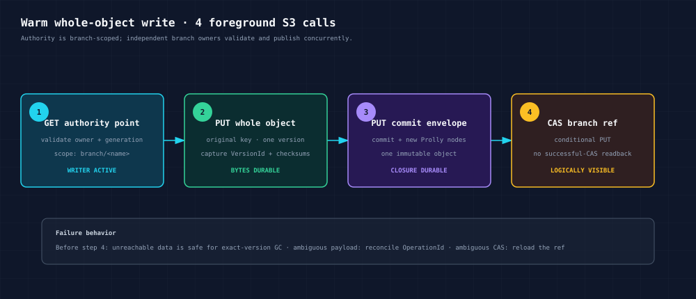

# Prolly S3 architecture

Status: implemented architecture; production qualification incomplete.

## Decision

The S3 extension has one storage architecture:

- whole files are physical S3 object versions at their original keys;
- Prolly commits are authoritative for current state and history;
- each logical version records the exact provider-issued `VersionId`;
- the Prolly wrapper is the exclusive writer for managed keys;
- one fenced writer service serializes mutation publication;
- repository metadata uses format v1 under `.prolly/v1/`.

The repository-chunked profile, profile selector, mixed-mode codec, durable
workspace protocol, publication lease, and compatibility harness are removed.
There is no in-place upgrade from the former format.


## Why whole objects

S3 already supplies immutable physical versions. Splitting an ordinary file
into repository chunks duplicated that job and required chunks, a content
index, and a manifest before Prolly could publish metadata. The physical design
keeps each concern in the layer that owns it:

| Concern | Authority |
|---|---|
| File bytes and physical retention | Versioned S3 |
| Current logical key set | Prolly object tree |
| Logical version history | Prolly version tree |
| Idempotent operations | Prolly operation tree |
| Branches, tags, merges, restore | Prolly commit graph |
| Visibility of a prepared commit | Branch-ref CAS |

## Required invariants

1. Bucket versioning is `Enabled`, never suspended.
2. The client is the only writer to managed data keys and repository paths.
3. Every successful physical mutation returns a non-empty S3 `VersionId`.
4. Canonical reads specify both key and recorded physical `VersionId`.
5. Payload version and the combined commit/node-pack envelope are durable
   before the ref CAS.
6. Only the branch-ref CAS changes logical visibility.
7. A writer-fence generation is carried by refs and commits.
8. A stale or ambiguous writer lease fails closed.
9. Lifecycle configuration cannot expire any retained managed version.
10. GC deletes only exact, unreachable `(key, VersionId)` pairs.

## Identity model

Logical and physical identities are deliberately separate:

- `ObjectVersionId` identifies a logical Prolly version.
- S3 `VersionId` identifies bytes or a delete marker in one provider bucket.
- `CommitId` identifies one immutable bucket snapshot.
- the mutable ref's storage token is the compare-and-exchange authority.

An `ObjectVersionV1` contains a canonical logical body plus a physical binding.
The logical ID excludes the provider binding, allowing a clone to retain
logical history while rebinding to destination-issued S3 versions.

## Format v1 layout

User objects stay at their normal keys. Repository metadata is isolated:

```text
reports/q3.parquet                         # S3 version v1, v2, ...
photos/launch.jpg                          # S3 version v1, v2, ...

.prolly/v1/
├── format/v1.cbor                         # create-once RepositoryFormatV1
├── format/initialization.cbor             # create-once initialization intent
├── providers/<profile-id>.cbor            # signed provider qualification
├── writers/lease.cbor                     # exclusive writer fence
├── refs/heads/<encoded-branch>            # mutable CAS ref + inline reflog
├── refs/tags/<encoded-tag>                 # mutable CAS ref
├── node-index/checkpoints/...              # rebuildable locator checkpoints
├── node-index/latest.cbor                   # mutable checkpoint pointer
├── commits/sha256/<2>/<2>/<id>              # commit + Prolly node envelope
├── retention/pins/...                      # explicit GC roots
└── gc/...                                  # resumable exact-version GC state
```

There are no payload chunks, content manifests, delta side objects,
workspaces, publication leases, or repository multipart-part objects.

## Single-object publication



For a warm writer:

1. The writer validates the current branch head and write conditions.
2. `PutObject(key, body)` creates one physical object version.
3. The returned `VersionId`, checksums, headers, and logical metadata are added
   to the in-memory Prolly state transition.
4. New tree nodes and `BucketCommitV1` are encoded in one immutable commit
   envelope.
5. One conditional ref update publishes the commit.

Foreground request budget: exactly three S3 calls. No CAS readback is issued.
If the ref CAS conflicts, the prepared payload and metadata are unreachable
orphans until GC; the client reports the conflict and never silently rebases.

## Atomic multi-object publication

`begin_commit` holds staged puts and deletes in process. At `publish`, the
writer performs all `N` physical mutations with bounded parallelism, builds one
final Prolly state, uploads one commit envelope, then performs one ref CAS.

Budget: `N + 2` S3 calls. Two keys therefore require four calls.

The session is atomic but not durable before `publish`. Process loss discards
the in-memory session; any physical versions created during a failed publish
remain unreachable and are later GC candidates.

## Reads

Current and historical reads follow the same protocol:

1. Pin a branch head or caller-selected commit.
2. Resolve the logical key in that commit's Prolly trees.
3. Read `GetObject(key, version_id = recorded_version_id)`.
4. Validate the returned length and checksums against committed metadata.

A raw `GetObject(key)` or provider listing is diagnostic. It cannot represent
another branch or an older Prolly snapshot.

## Delete, copy, merge, and restore

- Delete creates a physical S3 delete marker and commits its exact `VersionId`.
- Same-bucket copy asks S3 to create a new destination version and records it.
- Merge and restore reuse already-retained physical bindings when possible;
  they publish one commit envelope and one ref CAS.
- Cross-bucket clone/fetch/push/repair copies each required payload and records
  the new destination `VersionId`; provider IDs never cross bucket boundaries.

Warm merge and restore each use two S3 calls when no payload transfer is
needed.

## Multipart

Large files use provider-native multipart upload. Prolly does not store parts
or a chunk index. For `N` parts the foreground protocol is:

1. create multipart upload;
2. upload `N` physical parts;
3. complete multipart upload and capture its `VersionId`;
4. upload one commit envelope;
5. CAS the branch ref.

Budget: `N + 4` S3 calls. The upload handle contains the canonical session; a
new process can complete it when the caller supplies persisted part ETags,
SHA-256 values, sizes, and whole-object checksums.

## Concurrency and fencing

The architecture intentionally does not use optimistic multi-writer retry
loops. A repository-scoped lease grants one process mutation authority.
Concurrent callers inside that process upload payloads before a short
publication mutex; batch payload mutations use configurable bounded
parallelism. This keeps each completed warm write at three calls under 1, 8,
or 32 callers without serializing network upload time.

An operator may perform an explicit takeover after the old writer is stopped
or fenced. Commits and refs carry the lease generation, so the old writer
cannot publish after takeover. Read-only clients do not acquire the lease.

## Idempotency and ambiguous responses

Callers may supply a stable `OperationId`. The operation tree records the
input digest and canonical result in the same commit. Retrying the same
operation returns the committed result without uploading another payload.
In-process requests sharing an OperationId are singleflighted before the data
plane, preventing concurrent retries from creating duplicate orphan versions.

If a payload request's response is lost, reconciliation identifies the exact
physical version before publication. If final ref publication is ambiguous,
`lookup_operation` searches committed operation records. A mismatched input
under the same operation ID fails with an idempotency conflict.

## Garbage collection

Reachability starts from branches, tags, retained reflogs, and explicit pins.
GC walks commit envelopes, logical versions, and exact physical bindings. It
persists a bounded deletion plan and revalidates roots before each batch.

Deletion always specifies both key and physical `VersionId`. Automatic bucket
lifecycle deletion is incompatible with this model because it bypasses
reachability checks.

## Request budgets

These budgets exclude provider retries, cold open, provider qualification,
lease renewal, checkpointing, GC, and cross-bucket payload transfer:

| Warm logical operation | S3 calls |
|---|---:|
| Whole-object put/copy/delete | 3 |
| Atomic commit of `N` keys | `N + 2` |
| Merge or restore without transfer | 2 |
| Multipart with `N` parts | `N + 4` |
| Warm exact current/historical read | 1 |

Cold reads additionally load the selected ref/commit and range-read uncached
Prolly nodes. `CurrentObjectV1` stores the complete current version and binding,
so a current read needs one tree lookup rather than a second version-tree
lookup. Commit/branch caches are entry-bounded and packed-node cache is
byte-bounded.

Request counters are enforced in core contract tests and the whole-object and
multipart budgets are also exercised against RustFS.

## Production boundary

The architecture is not yet qualified for million-object production use.
Required release evidence includes:

- AWS general-purpose bucket validation in target regions;
- latency and request-price measurements for expected traffic mixes;
- throttling and retry behavior at sustained and burst load;
- hot-branch queue latency and lease renewal under load;
- one million live keys and at least ten million retained versions;
- crash tests around every physical mutation and ref CAS;
- backup/restore and exact-version GC drills with lifecycle guardrails;
- a restart/resume drill for incomplete multipart uploads;
- workload-specific validation of the enforced atomic-session memory bound.

Local RustFS proves protocol behavior and request shape, not AWS production
latency, durability, cost, or scale.

The proposed architecture for bounded hybrid caching, lazy sharded indexes,
resumable traversal, scalable ref listing, and partitioned garbage collection
is documented in [CACHE-AND-SCALE-DESIGN.md](CACHE-AND-SCALE-DESIGN.md).
