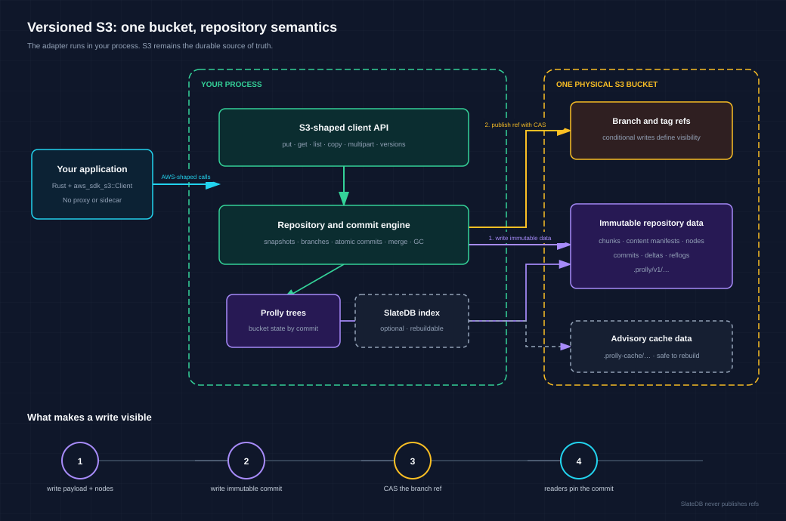

# Add repository history to an S3 bucket

This workspace contains a Rust client adapter that treats the complete state of one S3 bucket as a versioned repository. Your application keeps an AWS SDK-shaped object API while gaining immutable snapshots, atomic multi-object commits, branches, tags, diffs, merges, and recovery history.

> [!IMPORTANT]
> This project is a development preview. The local RustFS profile has functional, recovery, and cost evidence, but the production AWS qualification and release gates remain open. See [qualification status](QUALIFICATION.md#gates-intentionally-still-open) before planning a deployment.

## What problem this solves

Native S3 versioning records versions of individual objects. It does not create one commit that identifies the state of every key in a bucket.

The adapter adds that repository boundary:

| Need | Native S3 client | Versioned S3 client |
| --- | --- | --- |
| Replace one object | `PutObject` | S3-shaped `put_object()` |
| Read one older object | Native object version ID | Logical `ObjectVersionId` |
| Read a consistent bucket state | Application coordination | Immutable `CommitId` snapshot |
| Publish related keys together | Multiple visible writes | One atomic bucket commit |
| Compare or organize history | Application-specific metadata | Log, diff, branches, tags, and merge |
| Recover a mistaken ref update | Provider-specific tooling | Reflog and validated reset/recovery |

Use this client when your application needs repository semantics across objects. Use raw S3 when each object is independent and the lowest request count matters more than bucket history.

## Pick a starting point

| You want to… | Start with… |
| --- | --- |
| Understand the data model | [How the repository works](#how-the-repository-works) |
| Run it against local RustFS | [Run the local example](#run-the-local-example) |
| Add it to Rust code | [Use the client](#use-the-client) |
| Find a method or response type | [Complete API reference](API.md) |
| Check supported S3 fields | [Compatibility contract](compatibility-v1.json) |
| Deploy, recover, or run garbage collection | [Operations runbook](OPERATIONS.md) |
| Review measured evidence | [Qualification record](QUALIFICATION.md) |

## How the repository works

The adapter runs inside your Rust process. It uses the `aws_sdk_s3::Client` you supply, so your application still controls credentials, endpoint selection, transport, and AWS SDK retries. It is not an HTTP proxy or a wire-compatible S3 endpoint.



A publishing operation follows four steps:

1. Write payload chunks, content manifests, and Prolly tree nodes as immutable objects
2. Write an immutable commit that names the resulting bucket state
3. Publish the commit with one conditional branch-reference write
4. Return the new `CommitId` after the reference update succeeds

The branch-reference compare-and-swap (CAS) is the visibility point. Readers see the previous complete commit or the next complete commit, never a partially published state.

### History is bucket-wide

Each commit points to the complete logical bucket state. Branches and merges form a commit graph:

```text
main:     C0---C1---------------M
               \               /
feature:        F1---F2---------
```

An object mutation creates a logical object version and a bucket commit. An atomic session can create several object versions under one commit.

| Identifier | Meaning |
| --- | --- |
| `ObjectVersionId` | One logical version of one key |
| `CommitId` | One immutable snapshot of the logical bucket |
| Provider ETag | Compare-and-swap token for a physical object |
| Provider version ID | Native S3 version used for physical recovery and garbage collection |

These identifiers are not interchangeable. Native bucket versioning is optional for normal operation, but recommended for defense-in-depth ref recovery.

### S3 is authoritative

Canonical repository data lives under a reserved prefix such as `.prolly/v1/`. The prefix contains immutable chunks, tree nodes, commits, deltas, reflogs, and mutable coordination records.

SlateDB is an optional advisory index. It can share the physical bucket under `.prolly-cache/`, but it never publishes a branch or owns canonical state. Deleting the cache must affect performance only; `rebuild_advisory_index` reconstructs it from S3.

## Run the local example

Install Docker Compose and Rust 1.94.1 before running the example. The checked-in profile starts RustFS on loopback and stores data in `/Volumes/Workspace/prolly-data` by default. Its credentials are for local development only.

### 1. Start RustFS

This command creates the data directory, starts RustFS, and waits for its health check:

```bash
mkdir -p /Volumes/Workspace/prolly-data
docker compose --env-file s3/.env.example \
  -f s3/docker-compose.rustfs.yml up -d --wait
curl --fail http://127.0.0.1:9000/health
```

### 2. Verify the S3 endpoint

This script checks the credentials, bucket access, byte round trip, and exact-version cleanup with AWS CLI `s3api` commands:

```bash
bash s3/scripts/verify_rustfs_aws_cli.sh
```

The verifier defaults to `prolly-versioned-s3-demo`. Override the `PROLLY_RUSTFS_*` environment variables when needed. Its probe key stays outside the repository namespace, and the script removes the exact probe version after a successful check.

### 3. Run the repository example

The example initializes a repository, writes two versions, reads an immutable historical snapshot, lists keys, computes a diff, and verifies the reachable repository:

```bash
PROLLY_RUSTFS_ENDPOINT=http://127.0.0.1:9000 \
PROLLY_RUSTFS_ACCESS_KEY=prollyadmin \
PROLLY_RUSTFS_SECRET_KEY=prolly-local-secret-change-me \
CARGO_TARGET_DIR=/Volumes/Workspace/prolly-build/versioned-s3 \
  cargo +1.94.1 run --manifest-path s3/Cargo.toml \
  -p prolly-s3-client --example rustfs_versioned_bucket
```

The program prints the bucket, repository prefix, two commit IDs, listed-object count, diff count, and integrity-check totals. The complete source is in [`rustfs_versioned_bucket.rs`](client/examples/rustfs_versioned_bucket.rs).

### 4. Stop RustFS

This command stops the container without deleting persisted data:

```bash
docker compose -f s3/docker-compose.rustfs.yml down
```

## Use the client

Create an ordinary AWS SDK client first. Then bind the adapter to one bucket, one repository prefix, and one default branch. The snippets below assume `aws`, `attestation_signer`, and `token_signer` use your deployment configuration.

### Initialize or open a repository

Call `initialize()` during provisioning. It qualifies the configured provider and idempotently creates the repository. Normal application processes should supply the same identity and verification keys, then call `open()` without probe writes.

```rust,no_run
use prolly_s3_client::{Client, ProviderIdentity};

let client = Client::builder()
    .aws_client(aws)
    .bucket("assets")
    .repository_prefix(".prolly/v1")
    .default_branch("main")
    .writer("asset-service")
    .provider_identity(ProviderIdentity::aws_region("us-west-2"))
    .attestation_signer(attestation_signer)
    .token_signer(token_signer)
    .initialize()
    .await?;
```

Production deployments should load separate provider-attestation and cursor-signing key rings from a secret manager. Cursor verification keys must overlap for the configured token lifetime during rotation.

### Write and read a historical version

S3-shaped builders return `Versioned<T>`. The `snapshot` field identifies the exact bucket commit used or created by the operation.

```rust,no_run
use aws_sdk_s3::primitives::ByteStream;

let first = client
    .put_object()
    .bucket("assets")
    .key("greeting.txt")
    .body(ByteStream::from_static(b"version one"))
    .send()
    .await?;

client
    .put_object()
    .bucket("assets")
    .key("greeting.txt")
    .body(ByteStream::from_static(b"version two"))
    .send()
    .await?;

let historical = client.at(first.snapshot).await?;
let original = historical
    .get_object()
    .bucket("assets")
    .key("greeting.txt")
    .send()
    .await?;
```

Current reads use the client’s branch head. `client.at(commit_id)` creates a read-only view pinned to an immutable commit.

### Publish related objects atomically

A durable commit session stages several changes and publishes them with one branch update:

```rust,no_run
use aws_sdk_s3::primitives::ByteStream;

let mut commit = client
    .begin_commit()
    .message("publish site")
    .start()
    .await?;

commit.put_object()
    .bucket(client.bucket())
    .key("index.html")
    .body(ByteStream::from_static(b"home"))
    .stage()
    .await?;

commit.put_object()
    .bucket(client.bucket())
    .key("app.js")
    .body(ByteStream::from_static(b"app"))
    .stage()
    .await?;

let receipt = commit.publish().await?;
```

If a process stops before publication, reopen the durable workspace with `resume_commit(workspace_id)`. Publication requires the original base commit and never silently rebases.

## Find the operation you need

The common entry points are grouped by task:

| Task | API |
| --- | --- |
| Put, get, head, copy, delete, or list | `put_object`, `get_object`, `head_object`, `copy_object`, `delete_object`, `delete_objects`, `list_objects_v2` |
| Inspect logical object history | `list_object_versions` and selected-version reads |
| Upload large objects | Multipart create, upload, copy-part, list, complete, abort, and expiry APIs |
| Publish several changes | `begin_commit` and `resume_commit` |
| Read stable history | `at`, `head_commit`, `log_page`, and `diff_page` |
| Organize history | Branch, tag, merge, restore, reset, and reflog APIs |
| Move repositories | `clone_to`, `fetch_from`, `fetch_from_resumable`, and `push_to` |
| Verify or repair data | `fsck`, `fsck_commit`, and `repair_missing_from` |
| Retain or reclaim data | Retention-pin and explicit garbage-collection APIs |

See the [complete API reference](API.md) for every builder method, request field, response type, error, and example. The machine-readable [compatibility contract](compatibility-v1.json) defines accepted AWS fields and intentional exclusions.

## Understand failures and retries

The client separates AWS SDK transport retries from logical branch-conflict retries. `logical_retry_limit` controls only repository ref conflicts.

| Result | Meaning | Application action |
| --- | --- | --- |
| `Timeout` before I/O | The operation did not start provider work | Retry according to policy |
| `RefConflict` | Another writer changed the branch | Reload the head or let the bounded logical retry run |
| `OutcomeUnknown` | Provider work may have completed before the deadline or connection failure | Call `reconcile_operation` with the same operation ID |
| `UnsupportedParameter` | The request used an AWS field outside the compatibility contract | Change the request; the field was not ignored |
| `Corrupt*` or `MissingClosure` | Canonical repository data failed validation | Stop publication and follow the recovery runbook |

Publishing operations use stable operation IDs for idempotency. Never retry an ambiguous mutation with a different ID. The [operations runbook](OPERATIONS.md#ambiguous-mutation-outcome) contains the complete reconciliation procedure.

## Know the current limits

The v1 contract favors correctness and recoverability over raw single-object throughput.

| Area | Current limit or tradeoff |
| --- | --- |
| Deployment | Rust in-process client only; no S3-compatible HTTP endpoint |
| S3 compatibility | Supported field subset; unknown official fields fail closed |
| Logical deletion | Selected logical-version deletion is not supported |
| Write cost | One logical write creates immutable metadata and publishes a ref; it is not one physical `PutObject` |
| Hot-branch concurrency | Writers contend on one branch ref; use branches or batch related work when possible |
| Keyspace scale | Trees and APIs are paged, but a million-object production workload has not been qualified |
| Background work | `open()` starts no workers; multipart expiry, integrity checks, index rebuild, and garbage collection are explicit |
| Garbage collection | Requires a persisted dry run and a separately approved, fenced sweep |
| Native bucket versioning | Optional for correctness; recommended for native ref-recovery history |
| Production status | Local RustFS evidence exists; AWS, release-topology soak, IAM, cost, and recovery gates remain open |

The measured local cost explains why small sequential writes are slower than raw S3. A 64 KiB put used 51 object-plane calls in the RustFS cost matrix. A separate 20-write sequential run averaged 1.988 writes per second with zero SDK retries. These numbers describe one local single-node setup, not a service-level objective. See [measured development baselines](QUALIFICATION.md#measured-development-baselines) for the complete call, byte, contention, and memory data.

## Operate it safely

S3 owns canonical state, so operational actions must preserve the repository protocol:

- Reserve and protect the repository prefix
- Use stable writer identities and managed signing-key rotation
- Qualify the provider before initialization
- Reconcile ambiguous writes before retrying
- Run `fsck_commit` or `fsck` explicitly
- Inspect and approve a garbage-collection plan before any sweep
- Never repair canonical objects with raw path overwrite or path-only deletion

The [operations and recovery runbook](OPERATIONS.md) defines IAM roles, health checks, outage handling, cache rebuild, GC approval and abort, backup and restore, and credential rotation.

## Validate a change

Run the fast workspace checks before opening a pull request:

```bash
cargo check --manifest-path s3/Cargo.toml --workspace --all-features
cargo test --manifest-path s3/Cargo.toml -p prolly-s3-core
bash s3/scripts/check_clean_downstream.sh
```

Run the live RustFS suite when a change affects provider behavior:

```bash
PROLLY_S3_RUSTFS=1 \
PROLLY_RUSTFS_ENDPOINT=http://127.0.0.1:9000 \
PROLLY_RUSTFS_ACCESS_KEY=prollyadmin \
PROLLY_RUSTFS_SECRET_KEY=prolly-local-secret-change-me \
  cargo test --manifest-path s3/Cargo.toml \
  -p prolly-s3-client --test rustfs_repository --all-features
```

Release candidates also require dependency-policy, real AWS, differential, contention, cost, outage, backup, and soak evidence. The [qualification record](QUALIFICATION.md) lists commands, measured results, and open gates without turning this landing page into a release runbook.

## Documentation map

Each document has one job:

| Document | Use it for |
| --- | --- |
| [API reference](API.md) | Every public method, request, response, error, and example |
| [Compatibility contract](compatibility-v1.json) | Machine-readable supported fields and fail-closed behavior |
| [Operations runbook](OPERATIONS.md) | Deployment, recovery, integrity, GC, backup, and key rotation |
| [Qualification record](QUALIFICATION.md) | Dated test evidence, performance measurements, and open release gates |
| [Completion audit](COMPLETION-AUDIT.md) | Requirement-by-requirement evidence status |
| [Technical design and phased plan](../plans/020-versioned-s3-client-adapter.md) | Design decisions, durable formats, algorithms, phase gates, and rollback boundaries |
| [Canonical fixtures](fixtures/canonical-v1.json) | Language-neutral CBOR and identifier compatibility examples |

The physical bucket remains the source of truth across every document and workflow. SlateDB is always optional and rebuildable.
