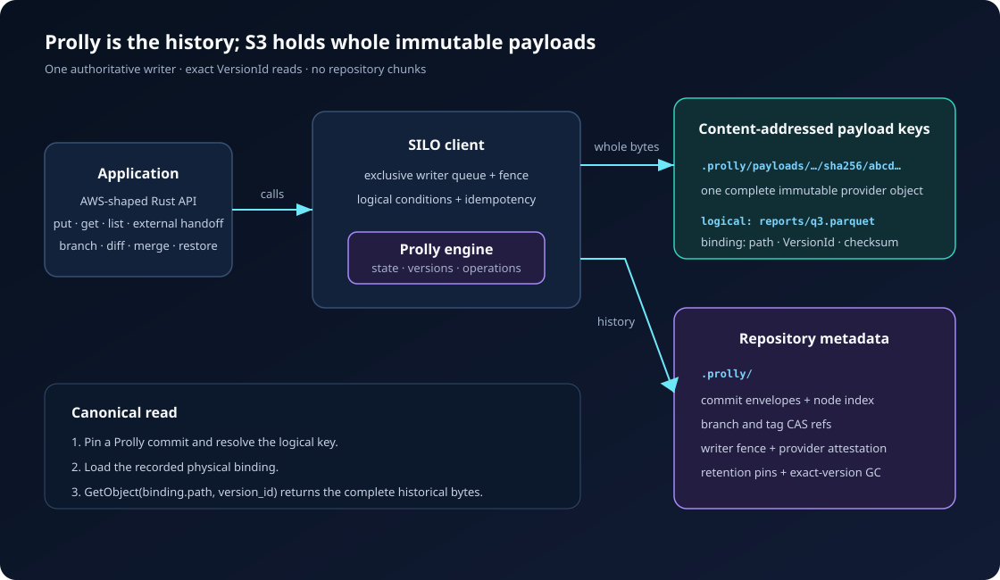

# Prolly S3

Prolly S3 adds repository history to a versioned S3 bucket. It stores each file
as one immutable, content-addressed S3 object and stores directory state,
commits, branches, tags, and indexes as Prolly trees.

The client is the authoritative writer for its repository prefix. Applications
must not mutate repository data behind it.



## What it provides

- whole-file `put`, `get`, delete, list, and historical reads;
- atomic multi-file commits;
- branches, tags, diffs, and resumable structural merges;
- branch-local writer fencing and concurrent publication across branches;
- immutable payload and node caching, including optional Foyer caching;
- operation-ID reconciliation for ambiguous publication responses;
- bounded journal, operation, and ref-catalog indexes.

## Start here

- [Client guide](client/README.md) — setup and runnable Rust examples
- [API guide](API.md) — task-to-method reference
- [Architecture](PROLLY-S3-DESIGN.md) — data model and write/read paths
- [Cache and scale design](CACHE-AND-SCALE-DESIGN.md)
- [Operations](OPERATIONS.md)
- [Qualification](QUALIFICATION.md)
- [Durable paths](spec/prolly-s3/paths.md)
- [State machines](spec/prolly-s3/state-machines.md)

Run the RustFS example:

```bash
docker compose -f extensions/s3/docker-compose.rustfs.yml up -d
cargo run --manifest-path extensions/s3/Cargo.toml \
  -p prolly-s3-client --example rustfs_versioned_bucket
```

## Boundaries

This implementation deliberately does not chunk file bodies. One logical file
is one immutable payload object, so each file must fit the configured repository
limit and the provider's single-`PutObject` limit. Use commit sessions to batch
many files, not to split one file.

The repository can scale its immutable trees and history without a fixed
cardinality ceiling, but “unlimited” is not literal: provider quotas, request
cost, latency, cache size, branch contention, and retained unreachable objects
remain operational limits. Garbage collection and cross-repository
backup/restore are not currently exposed as production APIs.
