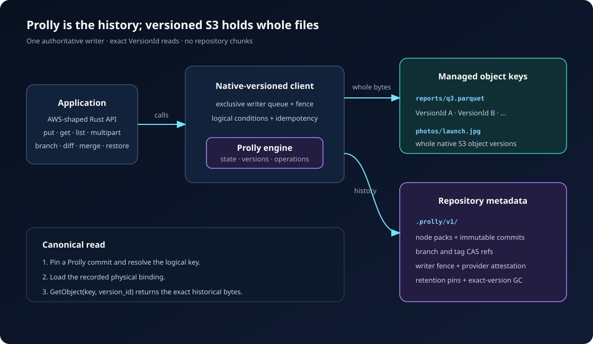
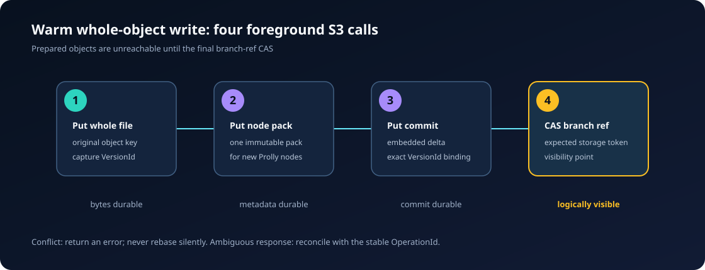

# Native-versioned S3 extension

This extension turns a versioned S3 bucket into a file repository with commits,
snapshots, branches, tags, diffs, merges, restore, and exact historical reads.
It is a thin wrapper around Prolly: file bytes stay as whole native S3 object
versions at their original keys, while Prolly records which exact `VersionId`
belongs to each logical commit.

There is one architecture. The former repository-chunked storage profile and
its compatibility surface have been removed.



## What a write does

A warm single-object write uses four foreground S3 operations:

1. Upload the whole file to its original key and capture its S3 `VersionId`.
2. Upload one immutable pack containing the new Prolly nodes.
3. Upload one immutable bucket commit.
4. Compare-and-exchange the branch ref; this is the visibility point.



No content chunks, content manifests, publication leases, durable staging
workspaces, or post-CAS readback are created. A two-object atomic commit uses
five calls: two payload writes followed by one node pack, one commit, and one
branch-ref CAS.

## Authority model

- Prolly is the logical authority. Applications must read and write through
  this client.
- The bucket must have native versioning enabled.
- The wrapper must be the exclusive writer for managed object keys.
- One fenced writer service owns mutations. Concurrent calls queue inside that
  service; independent writers need an explicit takeover.
- Reads always use the exact S3 `VersionId` recorded by the selected Prolly
  commit. A raw `GetObject` without `version_id` is not a canonical read.
- Bucket lifecycle rules must not expire versions managed by the repository.

## Crates

- `prolly-s3-client`: AWS SDK-shaped application API and S3 transport.
- `prolly-s3-core`: provider-neutral repository engine and object-plane trait.

See [client/README.md](client/README.md) for setup and concrete API examples,
[NATIVE-VERSIONED-S3-DESIGN.md](NATIVE-VERSIONED-S3-DESIGN.md) for the protocol,
and [OPERATIONS.md](OPERATIONS.md) for deployment constraints.

The frozen, language-neutral contract is
[Native-Versioned S3 Protocol v1](spec/native-versioned-s3/v1/README.md). It
includes CDDL, deterministic CBOR and hashing rules, the physical S3 layout,
state machines, a Smithy semantic API, and executable conformance vectors for
implementing compatible Java, Go, TypeScript, and other clients.

## Local RustFS verification

The checked-in Compose file runs a versioning-capable RustFS endpoint:

```bash
docker compose -f extensions/s3/docker-compose.rustfs.yml up -d

PROLLY_S3_RUSTFS=1 \
  cargo test --manifest-path extensions/s3/Cargo.toml \
  -p prolly-s3-client --test rustfs_repository -- --nocapture
```

The integration tests enforce these warm-path budgets:

| Operation | Foreground S3 calls |
|---|---:|
| 64 KiB whole-object put | 4 |
| Two-object atomic commit | 5 |
| Merge or restore | 3 |
| Multipart with `N` parts | `N + 5` |

The core contract also exercises 1, 8, and 32 concurrent callers and requires
four calls per completed whole-object write.

## Current limits

- The client is not a wire-compatible S3 proxy; it is an in-process Rust API.
- Managed keys cannot be modified by another S3 client.
- Native S3 `VersionId` values are provider-local and are rebound during clone,
  fetch, push, repair, or restore to another bucket.
- Atomic commit sessions buffer staged bodies in process until publication.
- Multipart session bookkeeping in the high-level client is process-local;
  completed native object versions and committed history are durable.
- Directory buckets and buckets with suspended versioning are unsupported.
- AWS latency, throttling, request-cost, hot-branch, and million-key release
  gates remain to be qualified. See [QUALIFICATION.md](QUALIFICATION.md).

## Development checks

```bash
cargo fmt --manifest-path extensions/s3/Cargo.toml --all -- --check
cargo check --manifest-path extensions/s3/Cargo.toml --workspace --all-features
cargo test --manifest-path extensions/s3/Cargo.toml --workspace --all-features
```
